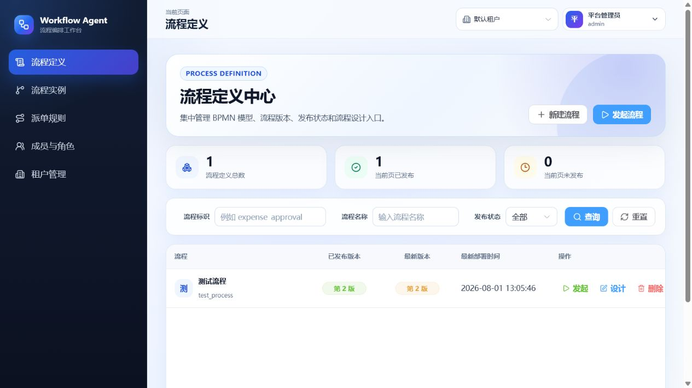
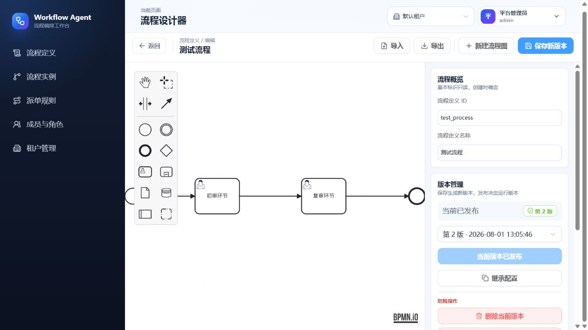
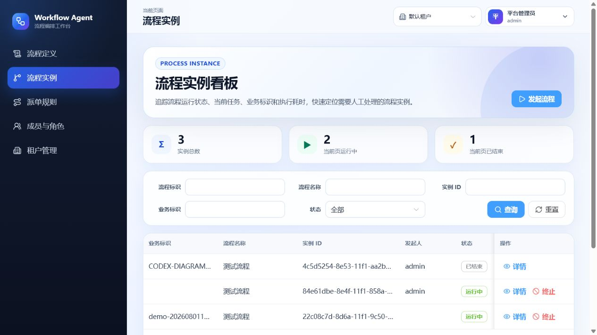
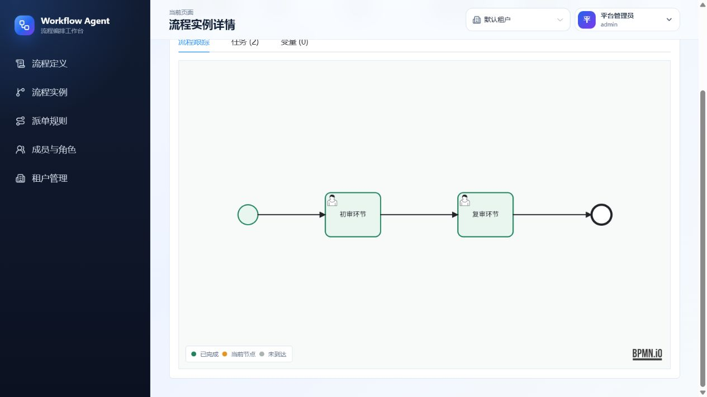
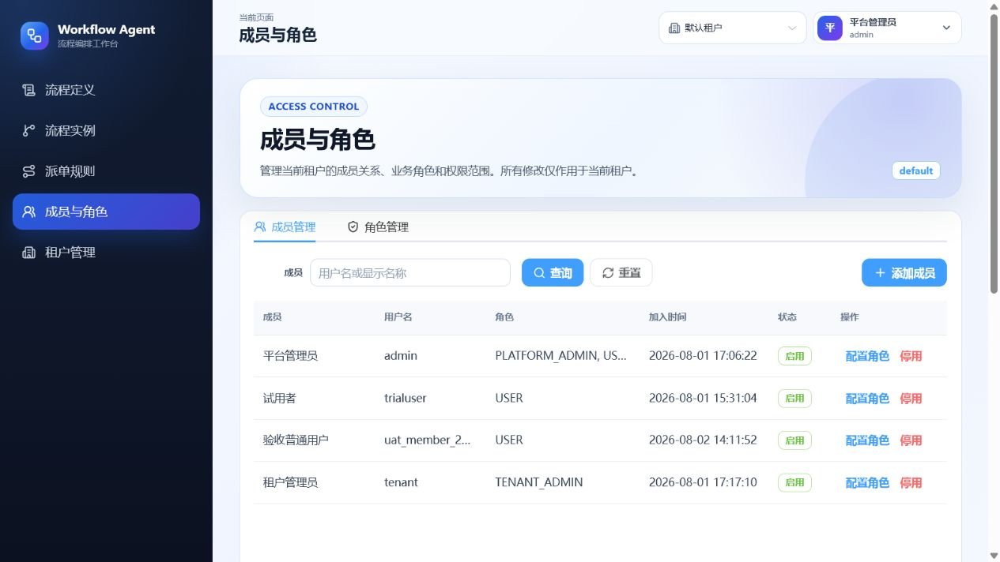
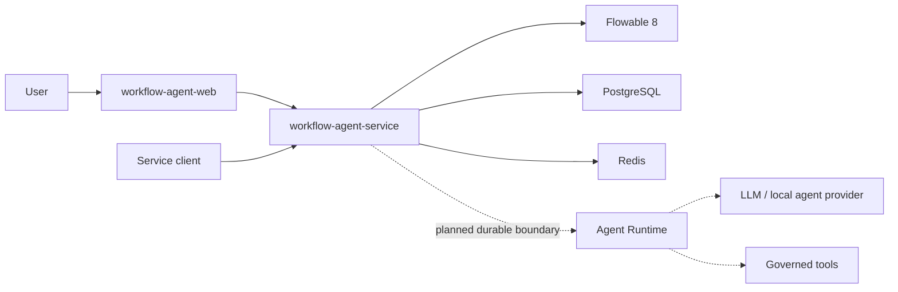

# Workflow Agent

[简体中文](README.zh-CN.md)

Workflow Agent is an open workflow platform for governed collaboration between people, BPMN processes, and AI agents. It is built around Flowable 8, Spring Boot 4, Java 25, Vue 3, PostgreSQL, and Redis.

> Development status: this project is under active development. The multi-tenant workflow platform and BPMN management UI are available. The Agent Runtime is architected but not implemented yet.
>
> Interested in this direction or have related ideas? Feedback, discussion, and collaboration are welcome at [emailnotfound@163.com](mailto:emailnotfound@163.com).

## Why this project

Most agent builders treat the agent as the orchestrator. Workflow Agent takes the opposite approach: BPMN owns durable business state and governs when an agent may act, wait for a person, invoke a tool, or resume after failure.

The target is a production-oriented Human-Agent Workflow platform with explicit tenancy, permissions, auditability, idempotency, human approval, and recoverable execution.

## Current capabilities

- BPMN definition import, modeling, deployment, version activation, and diagrams
- Process start, approval, rejection, transfer, termination, and execution tracking
- Tenant-aware users, roles, permissions, and service authentication
- Conditional node assignment rules and reusable rule evaluation
- Vue-based process management workspace powered by `bpmn-js`
- PostgreSQL persistence, Redis coordination, Flyway migrations, and architecture tests

## Product preview

### Workflow definition workspace



| BPMN modeler and version management | Process instance operations |
| --- | --- |
|  |  |

| Execution tracking | Tenant access control |
| --- | --- |
|  |  |

## Architecture



The source remains split into independently releasable repositories. This repository is the product entry point and local composition layer.

| Component | Responsibility |
| --- | --- |
| [`workflow-agent-service`](https://github.com/illuseahashmap/workflow-agent-service) | Maven multi-module backend, Flowable integration, security, tenancy, rules, and the future Agent Runtime |
| [`workflow-agent-web`](https://github.com/illuseahashmap/workflow-agent-web) | Vue 3 management UI and BPMN modeler |

## Quick start

Requirements: Git, Docker Engine, and Docker Compose.

```bash
git clone --recurse-submodules https://github.com/illuseahashmap/workflow-agent.git
cd workflow-agent
cp .env.example .env
docker compose up --build
```

Open `http://localhost:5174`. The default local administrator values are read from `.env`.

The included credentials are only for local evaluation. Replace them before exposing the services to another machine. The backend API is available at `http://localhost:8080`, and its health endpoint is `http://localhost:8080/actuator/health`.

If the repository was cloned without submodules:

```bash
git submodule update --init --recursive
```

## Repository layout

```text
workflow-agent
|-- compose.yaml
|-- deploy/
|-- docs/
|-- examples/
|-- workflow-agent-service/  Git submodule
`-- workflow-agent-web/      Git submodule
```

## Roadmap

1. Stabilize the workflow, tenancy, permission, and assignment-rule baseline.
2. Implement durable Agent Runs, provider credentials, checkpoints, and governed tool calls.
3. Add Agent collaboration nodes, User Task Copilot, and explicit human review.
4. Publish versioned deployment assets, examples, observability, and recovery tests.

See [Agent collaboration architecture](docs/agent-collaboration-architecture.md) for the design constraints and implementation sequence.

## Contributing

The project is in its architecture and baseline phase. Start with a focused issue before proposing a broad change, and keep backend and frontend changes aligned with their independent release boundaries. See [CONTRIBUTING.md](CONTRIBUTING.md).

## License

A project license has not been selected yet. Do not treat the current public source as permission for production redistribution until a license is added.
