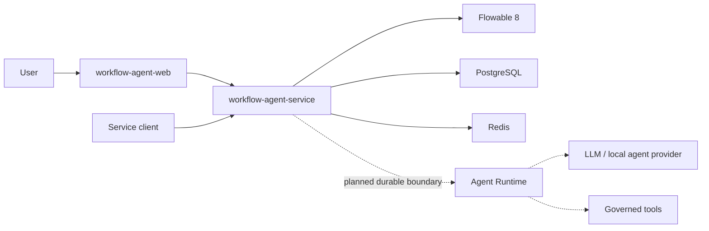

# Workflow Agent

[简体中文](README.zh-CN.md)

Workflow Agent is an open-source, Java-first enterprise Human-Agent Workflow platform built on Flowable OSS. It is built around Flowable 8, Spring Boot 4, Java 25, Vue 3, PostgreSQL, and Redis.

> Development status: this project is under active development. The multi-tenant workflow platform and BPMN management UI are available. Agent definitions, providers, and the runtime ledger foundation are implemented; the production execution loop remains in progress.
>
> Interested in this direction or have related ideas? Feedback, discussion, and collaboration are welcome at [emailnotfound@163.com](mailto:emailnotfound@163.com).

## Why this project

Most agent builders treat the agent as the orchestrator. Workflow Agent takes the opposite approach: BPMN owns durable business state and governs when an agent may act, wait for a person, invoke a tool, or resume after failure.

The project neither replaces Flowable nor copies Dify. It adds enterprise approval semantics above Flowable OSS and combines them with a durable, governed Agent Runtime.

See the [product positioning and goals](docs/product-positioning-and-goals.zh-CN.md) for the product boundary and staged objectives.

## Current capabilities

- BPMN definition import, modeling, deployment, version activation, and diagrams
- Process start, approval, rejection, transfer, termination, and execution tracking
- Tenant-aware users, roles, permissions, and service authentication
- Conditional node assignment rules and reusable rule evaluation
- Vue-based process management workspace powered by `bpmn-js`
- PostgreSQL persistence, Redis coordination, Flyway migrations, and architecture tests

## Product preview

### Login experience

<p></p>

### Workflow definition workspace

<p></p>

### BPMN modeler and version management

<p></p>

### Process instance operations

<p></p>

### Execution tracking

<p></p>

### Tenant access control

<p></p>

## Architecture



The source remains split into independently releasable repositories. This repository is the product entry point and local composition layer.

| Component | Responsibility |
| --- | --- |
| [`workflow-agent-service`](https://github.com/illuseahashmap/workflow-agent-service) | Maven multi-module backend with Flowable, authentication, tenancy, rules, Agent definitions, Providers, reliable Agent runs, OpenAPI governance, and PostgreSQL RLS |
| [`workflow-agent-web`](https://github.com/illuseahashmap/workflow-agent-web) | Vue 3 management UI, BPMN modeler, Agent management, Provider configuration, and run diagnostics |

## Quick start

Requirements: Git, Docker Engine, and Docker Compose.

```bash
git clone --recurse-submodules https://github.com/illuseahashmap/workflow-agent.git
cd workflow-agent
cp .env.example .env
docker compose up --build
```

Open `http://localhost:5174`. The default local administrator values are read from `.env`.

The included credentials are only for local evaluation. Replace them before exposing the services to another machine. The backend API is available at `http://localhost:8080`, and its health endpoint is `http://localhost:8080/actuator/health`.

The backend currently provides the Agent management and model execution foundation: versioned Agent definitions, encrypted Provider credentials, Mock/OpenAI-compatible adapters, Worker leases, Attempts, Steps, Checkpoints, state history, and model invocation records. The next Agent milestone is the production execution loop: BPMN Agent nodes, cancellation, recovery takeover, human confirmation, tool policy, and full observability.

If the repository was cloned without submodules:

```bash
git submodule update --init --recursive
```

## Repository layout

```text
workflow-agent
|-- compose.yaml
|-- deploy/
|-- docs/
|-- examples/
|-- workflow-agent-service/  Git submodule
`-- workflow-agent-web/      Git submodule
```

## Roadmap

1. Complete the production baseline and enterprise workflow semantics.
2. Complete the production Agent Runtime execution loop.
3. Add autonomous nodes, human review, and User Task Copilot.
4. Build a testable Collaborative Process Generator.
5. Expand knowledge, tools, connectors, and process intelligence.

See [Agent collaboration architecture](docs/agent-collaboration-architecture.md) for the design constraints and implementation sequence.

The cross-repository quality baseline, unresolved risks, implementation order, and definition of done are maintained in the [Project governance and roadmap](docs/project-governance-roadmap.md).

## Contributing

The project is in its architecture and baseline phase. Start with a focused issue before proposing a broad change, and keep backend and frontend changes aligned with their independent release boundaries. See [CONTRIBUTING.md](CONTRIBUTING.md).

## License

A project license has not been selected yet. Do not treat the current public source as permission for production redistribution until a license is added.
