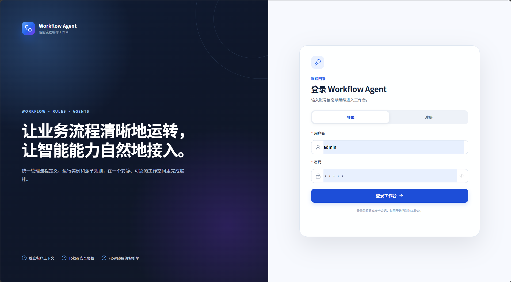
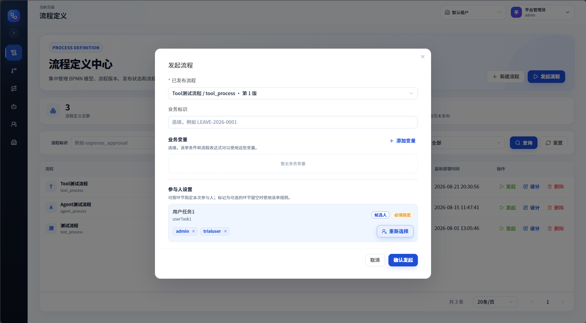
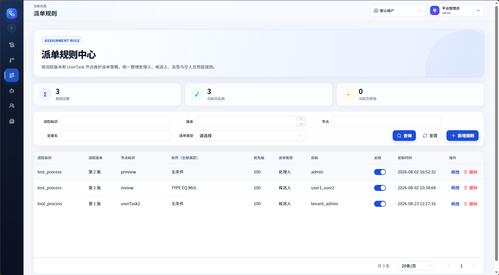
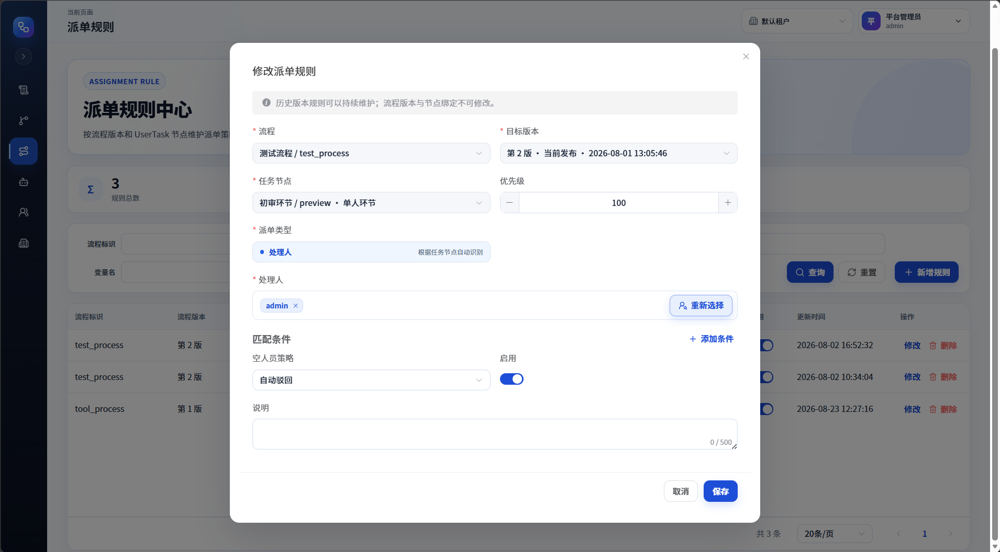
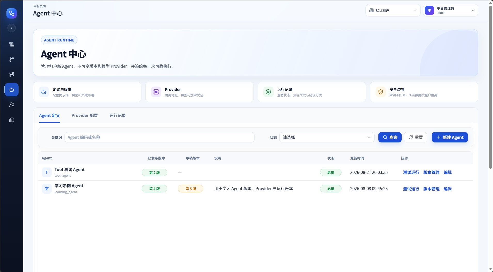
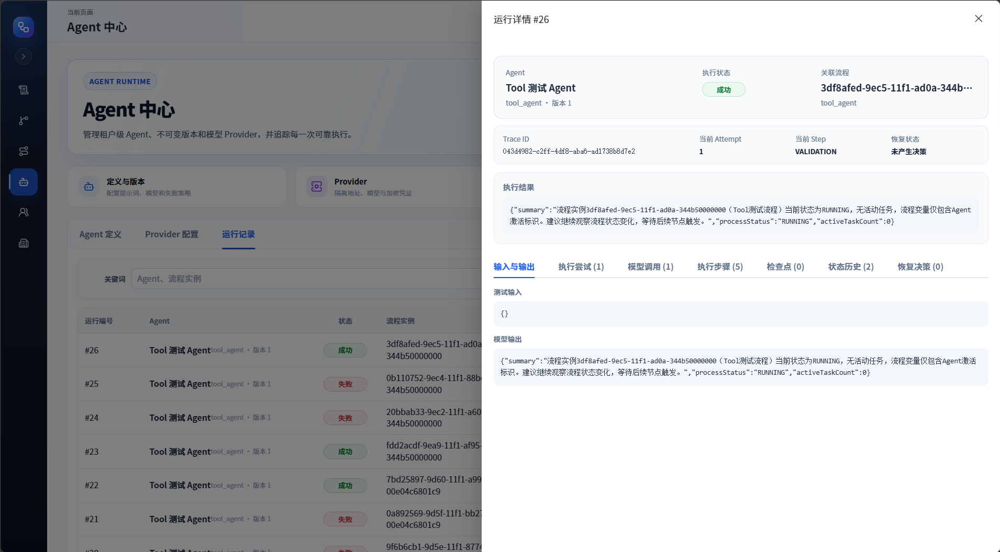
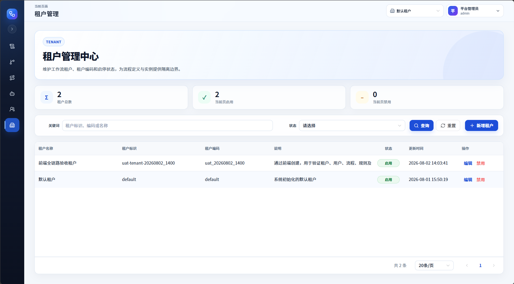
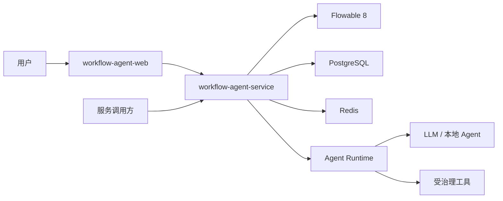

# Workflow Agent

[English](README.md)

Workflow Agent 是一个基于 Flowable OSS 的开源、Java-first 企业人机协作工作流平台，技术基线为 Flowable 8、Spring Boot 4、Java 25、Vue 3、PostgreSQL 和 Redis。

> 开发状态：项目正在持续开发中。多租户工作流平台、BPMN 管理界面、Agent 定义、Provider 配置、受治理的工具执行和持久化 Agent 运行账本已经具备；恢复、配额和可观测性等生产级能力仍在持续加固。
>
> 对这个方向感兴趣、已有相关想法，或希望交流与协作，欢迎随时联系：[emailnotfound@163.com](mailto:emailnotfound@163.com)。

## 项目定位

多数 Agent 编排产品让 Agent 成为总控。Workflow Agent 采用不同边界：由 BPMN 持有可持久化的业务状态，并明确控制 Agent 何时执行、等待人工、调用工具，以及如何在失败后恢复。

项目不替代 Flowable，也不复制 Dify。目标是在 Flowable OSS 执行原语之上补齐企业审批业务语义，并形成可持久化、受治理的 Human-Agent Workflow 能力，而不是只提供模型调用演示。

完整定位、产品边界和阶段目标见[《Workflow Agent 产品定位与目标》](docs/product-positioning-and-goals.zh-CN.md)。

## 当前能力

- BPMN 定义导入、建模、部署、版本启用与流程图查看
- 流程发起、审批、驳回、转办、终止与执行跟踪
- 租户级用户、角色、权限以及服务间鉴权
- 条件化节点派单规则与可复用规则计算
- 基于 Vue 3 和 `bpmn-js` 的流程管理工作台
- 版本化 Agent 定义、加密 Provider 凭据、模型执行、受治理工具、运行/尝试/步骤历史与恢复决策
- PostgreSQL 持久化、Redis 协调、Flyway 迁移与架构约束测试

## 产品预览

### 登录体验

<p></p>

### 流程定义工作台

<p></p>

### BPMN 建模与版本管理

<p></p>

### 流程实例操作

<p></p>

### 流程执行跟踪

<p></p>

### 租户与成员权限管理

<p></p>

### 代表性流程操作

<p></p>

<p></p>

<p></p>

### 代表性 Agent 操作

<p></p>

<p></p>

### 租户管理

<p></p>

## 总体架构



前后端源码继续保持独立仓库和独立发布边界。本仓库只负责统一产品入口、本地编排和跨仓库版本关系。

| 组件 | 职责 |
| --- | --- |
| [`workflow-agent-service`](https://github.com/illuseahashmap/workflow-agent-service) | Maven 多模块后端，包含 Flowable、认证、租户、规则、Agent 定义、Provider、受治理工具、可靠运行账本、OpenAPI 治理和 PostgreSQL RLS |
| [`workflow-agent-web`](https://github.com/illuseahashmap/workflow-agent-web) | Vue 3 管理界面、BPMN 设计器、Agent 管理、Provider 配置和运行诊断 |

## 快速启动

环境要求：Git、Docker Engine、Docker Compose。

```bash
git clone --recurse-submodules https://github.com/illuseahashmap/workflow-agent.git
cd workflow-agent
cp .env.example .env
docker compose up --build
```

浏览器访问 `http://localhost:5174`，默认本地管理员账号从 `.env` 读取。

示例凭据只能用于本机评估，对外暴露服务前必须替换。后端 API 地址为 `http://localhost:8080`，健康检查地址为 `http://localhost:8080/actuator/health`。

当前后端已经具备 Agent 管理和执行基础：版本化 Agent 定义、加密 Provider 凭据、Mock/OpenAI Compatible Adapter、Worker 租约、Attempt、Step、Checkpoint、受治理工具、状态历史、恢复决策和模型调用记录。剩余重点是让恢复、取消、配额、工具策略和可观测性在故障及多租户场景下达到生产级要求。

本聚合仓库将前后端子模块固定到各自 `main` 分支的提交。产品基线发生变化时，应同步更新两个子模块引用。

如果克隆时没有拉取子模块：

```bash
git submodule update --init --recursive
```

## 仓库结构

```text
workflow-agent
|-- compose.yaml
|-- deploy/
|-- docs/
|-- examples/
|-- workflow-agent-service/  Git 子模块
`-- workflow-agent-web/      Git 子模块
```

## 路线图

1. 完成 Agent Runtime 的恢复、取消、配额和可观测性加固。
2. 在不绕过 BPMN 状态所有权的前提下，实现自主节点、人工复核和 User Task Copilot。
3. 实现可测试的人机协作流程生成器。
4. 扩展知识、工具、连接器和流程智能。

详细约束和落地顺序见[《Agent 协作架构》](docs/agent-collaboration-architecture.md)。

跨仓库质量基线、潜在风险、实施顺序和完成标准统一记录在[《项目治理与演进路线》](docs/project-governance-roadmap.md)。

## 参与贡献

项目当前处于架构与基础能力建设阶段。大范围改动前应先创建聚焦的问题，并维持前后端独立发布边界，具体见 [CONTRIBUTING.md](CONTRIBUTING.md)。

## 许可证

项目尚未选定许可证。在许可证文件加入前，公开可见的源码不代表已经授予生产再分发权利。
