# Workflow Agent

[English](README.md)

Workflow Agent 是一个面向人与 Agent 协作的开放工作流平台，技术基线为 Flowable 8、Spring Boot 4、Java 25、Vue 3、PostgreSQL 和 Redis。

> 项目状态：早期开发阶段。多租户工作流平台与 BPMN 管理界面已经具备，Agent Runtime 已完成架构设计，但尚未实现。

## 项目定位

多数 Agent 编排产品让 Agent 成为总控。Workflow Agent 采用不同边界：由 BPMN 持有可持久化的业务状态，并明确控制 Agent 何时执行、等待人工、调用工具，以及如何在失败后恢复。

项目目标是形成生产导向的 Human-Agent Workflow 平台，重点解决租户隔离、权限、审计、幂等、人工审批和可恢复执行，而不是只提供模型调用演示。

## 当前能力

- BPMN 定义导入、建模、部署、版本启用与流程图查看
- 流程发起、审批、驳回、转办、终止与执行跟踪
- 租户级用户、角色、权限以及服务间鉴权
- 条件化节点派单规则与可复用规则计算
- 基于 Vue 3 和 `bpmn-js` 的流程管理工作台
- PostgreSQL 持久化、Redis 协调、Flyway 迁移与架构约束测试

## 总体架构

```mermaid
flowchart LR
    User["用户"] --> Web["workflow-agent-web"]
    Web --> Service["workflow-agent-service"]
    Client["服务调用方"] --> Service
    Service --> Flowable["Flowable 8"]
    Service --> PostgreSQL["PostgreSQL"]
    Service --> Redis["Redis"]
    Service -. "规划中的可靠边界" .-> Agent["Agent Runtime"]
    Agent -.-> Provider["LLM / 本地 Agent"]
    Agent -.-> Tools["受治理工具"]
```



前后端源码继续保持独立仓库和独立发布边界。本仓库只负责统一产品入口、本地编排和跨仓库版本关系。

| 组件 | 职责 |
| --- | --- |
| [`workflow-agent-service`](https://github.com/illuseahashmap/workflow-agent-service) | Maven 多模块后端、Flowable 集成、安全、租户、规则以及未来的 Agent Runtime |
| [`workflow-agent-web`](https://github.com/illuseahashmap/workflow-agent-web) | Vue 3 管理界面与 BPMN 设计器 |

## 快速启动

环境要求：Git、Docker Engine、Docker Compose。

```bash
git clone --recurse-submodules https://github.com/illuseahashmap/workflow-agent.git
cd workflow-agent
cp .env.example .env
docker compose up --build
```

浏览器访问 `http://localhost:5174`，默认本地管理员账号从 `.env` 读取。

示例凭据只能用于本机评估，对外暴露服务前必须替换。后端 API 地址为 `http://localhost:8080`，健康检查地址为 `http://localhost:8080/actuator/health`。

如果克隆时没有拉取子模块：

```bash
git submodule update --init --recursive
```

## 仓库结构

```text
workflow-agent
|-- compose.yaml
|-- deploy/
|-- docs/
|-- examples/
|-- workflow-agent-service/  Git 子模块
`-- workflow-agent-web/      Git 子模块
```

## 路线图

1. 稳定工作流、租户、权限和派单规则基线。
2. 实现可持久化 Agent Run、模型凭据、执行检查点和受治理工具调用。
3. 实现 Agent 协作节点、User Task Copilot 和显式人工复核。
4. 发布版本化部署资产、业务样例、可观测性和故障恢复测试。

详细约束和落地顺序见[《Agent 协作架构》](docs/agent-collaboration-architecture.md)。

## 参与贡献

项目当前处于架构与基础能力建设阶段。大范围改动前应先创建聚焦的问题，并维持前后端独立发布边界，具体见 [CONTRIBUTING.md](CONTRIBUTING.md)。

## 许可证

项目尚未选定许可证。在许可证文件加入前，公开可见的源码不代表已经授予生产再分发权利。
