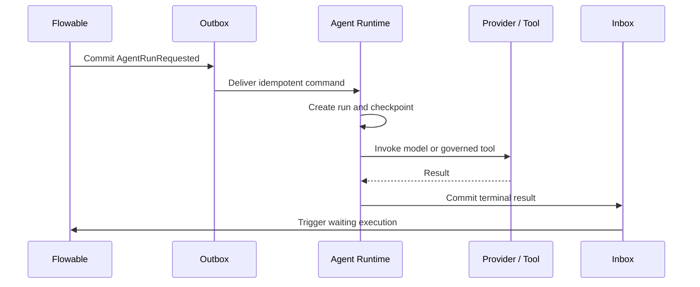

# Agent Collaboration Architecture

## Design position

Flowable owns BPMN execution and durable business state. The Agent Runtime owns model calls, conversations, governed tool execution, structured output, checkpoints, cost, and run status. Neither side writes directly into the other side's internal tables.

The integration is planned as a durable Outbox/Inbox boundary so model latency and provider failures never hold a Flowable database transaction open.

## Collaboration modes

1. **Autonomous Agent node**: an asynchronous, triggerable Service Task starts an Agent Run and resumes only after a durable result is accepted.
2. **User Task Copilot**: an agent may analyze and draft, while a person retains task-completion authority.
3. **Agent result with human review**: the process explicitly routes an agent result into a User Task before continuing.

## Non-negotiable controls

- Tenant-scoped, encrypted provider credential references; no API keys in BPMN XML.
- Immutable Agent versions bound to a deployed process version.
- Persisted checkpoints around model responses, tool requests, tool results, and human interruptions.
- Idempotent commands, worker leases, retry policy, and same-conversation serialization.
- Per-run limits for iterations, tool calls, tokens, duration, and cost.
- Tool identity, permissions, risk classification, approval, audit, and SSRF controls.
- Database-backed run history with recoverable SSE as a delivery channel, not the source of truth.

## Planned execution boundary

The detailed backend design and decision record live in `workflow-agent-service/docs/architecture/agent-collaboration-design.md` and will be versioned with the implementation.
